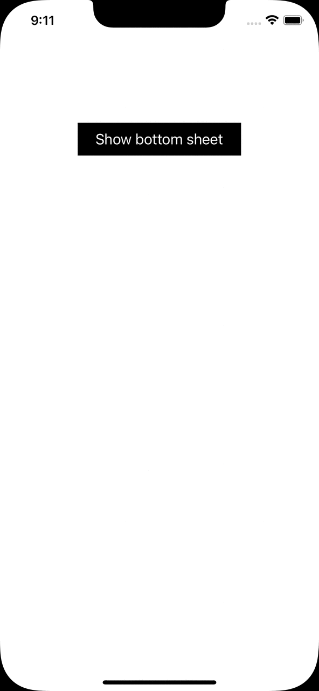

# BottomSheet for iOS
iOS 13+
Simple and neat BottomSheet for iOS using UIKit custom transition.
Automatically calculates the bottom sheet height depending on the content size.
Easy to use:
```swift
 let vc = ExampleViewController()
 vc.modalPresentationStyle = .custom
 vc.transitioningDelegate = delegate
 present(vc, animated: true)
```

It doesn’t support yet:
========
- Content scrolling if presented view controller's content height bigger that screen height;
- Using navigation (navigation controller) inside the bottom sheet.


